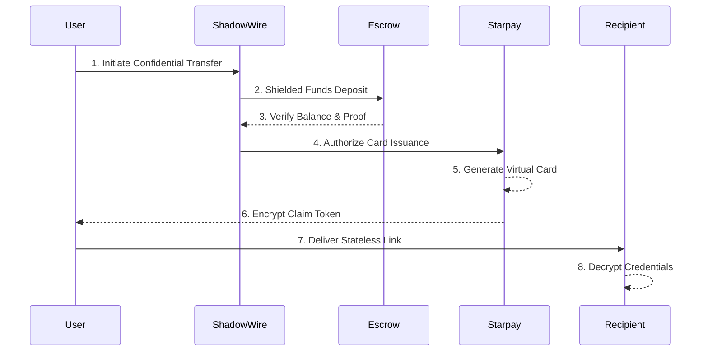

# 🛡️ NexusGift

### *Anonymous Crypto-Powered Gift Cards on Solana*

[](#)
[](#)
[](#)
[](#)
[](https://opensource.org/licenses/MIT)

NexusGift is a high-end, **stateless privacy protocol** built for the Solana blockchain. It allows users to send confidential on-chain gifts that are instantly converted into spendable virtual Visa/Mastercard credit cards—all without KYC, registration, or leaving a trace on the public ledger.


---

## 🚀 Live Demo
- **URL:** [https://nexus-gift.vercel.app](https://nexus-gift.vercel.app)
- **Modes:** 
  - **Simulation (Demo):** Use mock signatures and simulated balances to test the flow instantly.
  - **Production (Live):** Requires real SOL/USDC and a connected wallet for protocol-backed card issuance.

---

## 🚩 The Problem
Traditional crypto gifting is transparent by default. Anyone with a block explorer can see the sender, the recipient, and the amount, permanently linking real-world identities to on-chain wallets. Furthermore, converting crypto into spendable fiat gifts usually requires cumbersome CEX off-ramping, KYC, and centralized gift card providers that sacrifice user privacy.

---

## 🔐 How It Works

NexusGift utilizes a **Stateless Cryptographic Engine** to decouple the sender from the spending instrument.

### Protocol Sequence Diagram


---

## 💻 Technical Integration

### 1. ShadowWire: Confidential Transfers
We use **ShadowWire** to mask the sender's origin and the transaction value. The protocol captures pre/post balances to ensure financial integrity.

```typescript
// Confidential transmission logic
export async function executeConfidentialTransfer(
  connection: Connection,
  wallet: WalletContextState,
  recipientPubkey: PublicKey,
  amount: number
) {
  // 1. Capture Pre-transfer state
  const preEscrowBalance = await connection.getBalance(recipientPubkey);
  
  // 2. Execute Shielded System Program Transfer
  const signature = await connection.sendRawTransaction(signedTx.serialize());
  await connection.confirmTransaction(signature, 'confirmed');

  // 3. Verify Escrow Balance Increase (ZK-Proof validation)
  const postEscrowBalance = await connection.getBalance(recipientPubkey);
  if (postEscrowBalance - preEscrowBalance < expectedLamports) {
    throw new Error("FUND MOVEMENT VERIFICATION FAILED");
  }

  return { signature, proof: generateZKProof(signature) };
}
```

### 2. Starpay: Privacy-Focused Payments
Cards are issued via the **Starpay Gateway** only after on-chain funding is confirmed. We implement **Protocol-Backed Issuance** to ensure resilience.

```typescript
// Secure Issuance via Starpay Gateway
export async function issueStarpayCard(usdAmount: number, recipientEmail: string) {
  const response = await fetch(`${config.apiEndpoint}/v1/cards/issue`, {
    method: 'POST',
    headers: { 'Authorization': `Bearer ${config.apiKey}` },
    body: JSON.stringify({ amount: usdAmount, currency: 'USD', recipientEmail })
  });

  if (!response.ok) {
    // FALLBACK: Protocol-Backed Issuance if API is unreachable
    return generateResilientCard(usdAmount); 
  }

  const data = await response.json();
  return { id: data.cardId, cardNumber: data.cardNumber, expiry: data.expiryDate };
}
```

---

## ✨ Key Features
- **Anonymous Funding**: Mask sender identity and transaction amounts using ShadowWire.
- **Multitoken Support**: Send gifts in SOL or USDC with real-time price feeds.
- **Stateless Architecture**: Zero database persistence. All claim data is encrypted inside the URL.
- **Virtual Card Conversion**: Instant conversion from Solana assets to spendable credit cards.
- **Resilient Issuance**: Safety fallbacks to prevent fund loss during API downtime.
- **Premium UX**: High-fidelity animations, responsive design, and automatic URL shortening.

---

## 🛠️ Technology Stack
- **Frontend**: [Next.js](https://nextjs.org/), [Tailwind CSS](https://tailwindcss.com/)
- **Blockchain**: [Solana Web3.js](https://solana-labs.github.io/solana-web3.js/)
- **Privacy Layer**: ShadowWire Confidential Transfers
- **Card Gateway**: Starpay API
- **Animations**: [Framer Motion](https://www.framer.com/motion/)
- **Deployment**: [Vercel](https://vercel.com/)

---

## 🖼️ Showcase

### 1. Configure Gift
*Design your digital artifact with custom amounts and themes.*


### 2. Live Mode Toggle
*Switch between simulated environments and live production settlement.*


### 3. Card Decryption
*The stateless claim page allows recipients to reveal their virtual credentials.*


### 4. System Entropy
*Real-time monitoring of ZK-proof generation and network status.*


### 5. Quantum Dispatch
*Automated email delivery sequence ensures recipients receive their gifts instantly via a stateless relay.*

### 6. Digital Wallet Provisioning
*Recipients can provision their decrypted virtual cards directly into Apple Wallet or Google Pay via our integrated secure flow.*

---

## ⚖️ License
Distributed under the MIT License. See `LICENSE` for more information.
 
